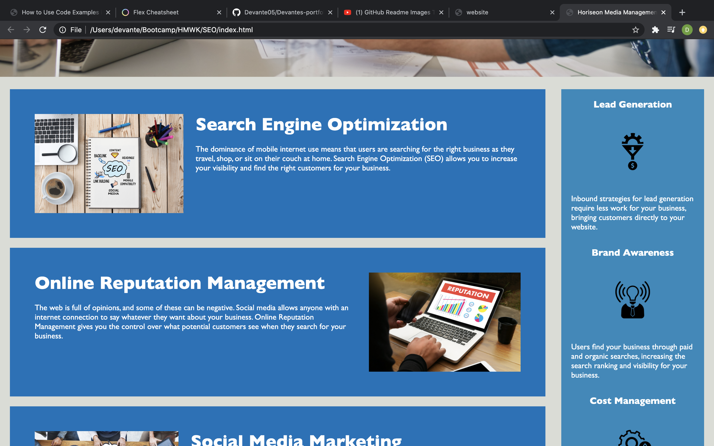
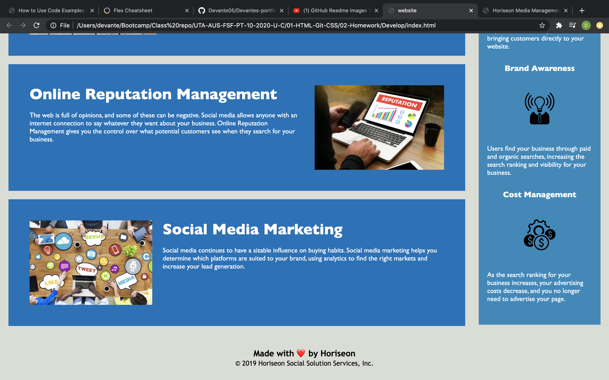

# Homework 1 Submission

## CHANGES
* Title given to page
* header semantic inserted within header
* nav semantic added within header container
* alt tags added on all images 
* aside semantic added 
* section sematic added within aside container
* non effective css deleted 

* Link to repo https://github.com/Devante05/SEO-Homework 
* https://devante05.github.io/SEO-Homework/.

# Screenshots of my website

  

   

   

# Screenshots of instructor website
    
    

    

    